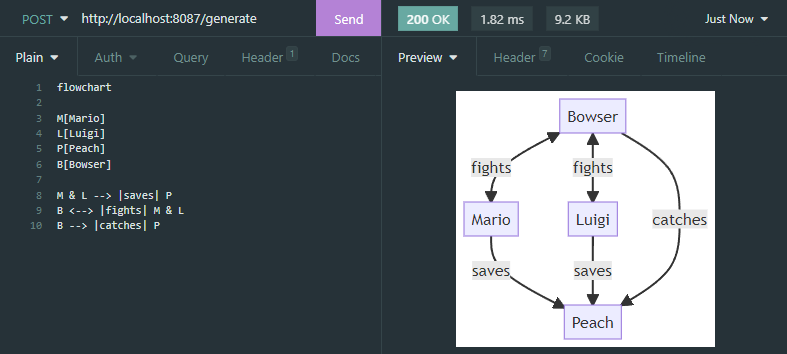

### Optional parameters
- `/generate?background=false` to remove background
- `/generate?format=svg` to change format (supported: svg, png, jpg)

### Docker
```bash
docker run -p 8087:8087 lukasss93/saas-mermaid
```