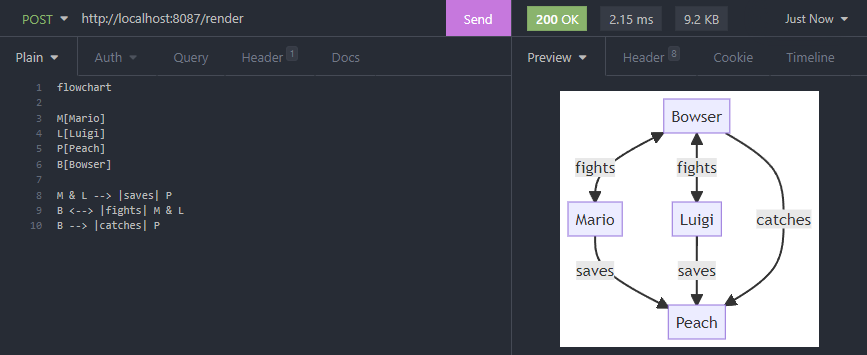

# Mermaid as a Service

[](https://hub.docker.com/repository/docker/lukasss93/saas-mermaid)




## 🚀 Installation

### 🔧 Manual
1. Clone this repository: `git clone lukasss93/saas-mermaid`
2. Install dependencies: `npm install`
3. Run the server: `npm start`

### 📦 Docker
```bash
docker run -p 8087:8087 lukasss93/saas-mermaid
```

## 👓 Usage

Send a  or  request to `http://localhost:8087/render` endpoint with the following parameters:

| Query Parameter | Available in                                                                                   | Default | Allowed values      | Description                                                                     |
|-----------------|------------------------------------------------------------------------------------------------|---------|---------------------|---------------------------------------------------------------------------------|
| text            |                                                  |         |                     | Chart text (⚠️ it must be an url encoded text)                                  |
| background      |   | `true`  | `true`, `false`     | Optional. Enable/disable the white background (not available when `format=jpg`) |
| format          |   | `svg`   | `svg`, `png`, `jpg` | Optional. Change the output image format                                        |

⚠️ When using the  method, you need to send the **chart text** as plain body. 

### 📊 Diagram Syntax
The chart text must be a valid Mermaid diagram.<br/>
More info here: https://mermaid-js.github.io/mermaid/

## 📃 Changelog

Please see the [CHANGELOG.md](CHANGELOG.md) for more information
on what has changed recently.

## 🏅 Credits

- [Luca Patera](https://github.com/Lukasss93)
- [All Contributors](https://github.com/Lukasss93/laravel-larex/contributors)

## 📖 License

Please see the [LICENSE.md](LICENSE.md) file for more
information.